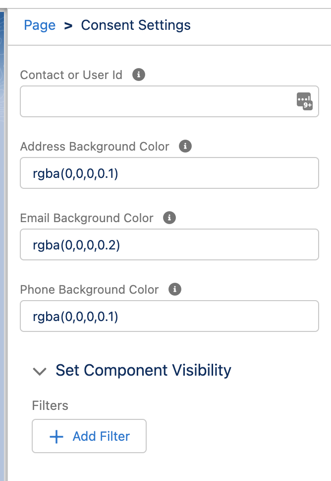

# Salesforce Consent Tools

[](https://github.com/tegeling/ConsentTools/actions/workflows/scratch-org-sfdx-ci-master.yml)
[](https://codecov.io/gh/tegeling/ConsentTools)

Manage consent settings and view historical consent data.
Enrich your user interface with a Lightning Web Component to easily change consent setting and opt in or opt out. Supports both internal and external access.

# Package Components

## Consent Setup App

This app groups all privacy objects that are relevant for the setup and configuration of consent settings like Data Use Legal Basis and Data Use Purpose.

## Consent Management App

This app groups all privacy objects that are relevant for the management of consent settings like Contacts, Individuals, Contact Point Consents.

## Flows

There are several Flows that support the consent automation.

### ContactTriggerSetIndividual

This flow checks if Contact records have an Individual record assigned. If missing, this flow creates a new Inndividual record and all related Contact Points, Contact Point Type Consent and Contact Point Consent records for each Data Use Purpose. The Privacy Consent Status is set to Opt Out.

### IndividualTriggerCleanup

To easily cleanup an Individual record, this flow iterates through all related privacy objects and removes related records. The flow can be started via a Record Update (like a button action).

### ContactPointEditor and ContactPointEditorExternal

This screen flow can be placed on Contact record pages or Community pages to either create new Contact Point records or delete existing records.

## Lightning Web Components

This package contains various LWC to support consent management.

### Consent Settings

Thic LWC can be placed on Lead or Contact records pages or on community pages. It dynamically shows a grid of toggles to either opt in or opt out per Contact Point and Data Use Purpose. It can be deployed as a preference center on a community page.


The properties contain the record id of either User (community use case, like `{!CurrentUser.id}`) or Contact/Lead records and color codes for the background colors per contact point type.


# Permissions and Record Sharing

Privacy objects are Salesforce standard objects with sharing settings for internal and external access.

## Default Sharing Settings

| Object                     | Default Internal Access | Default External Access |
| -------------------------- | ----------------------- | ----------------------- |
| Data Use Legal Basis       | Private                 | Private                 |
| Data Use Purpose           | Private                 | Private                 |
| Individual                 | Public Read/Write       | Private                 |
| Contact Point Type Consent | Private                 | Private                 |
| Contact Point Email        | Controlled by Parent    | Controlled by Parent    |
| Contact Point Phone        | Controlled by Parent    | Controlled by Parent    |
| Contact Point Address      | Controlled by Parent    | Controlled by Parent    |
| Contact Point Consent      | Private                 | Private                 |

Internal users who need access to privacy records owned by external users (service agent edits consent details of a customer), need to have a record sharing based on role hierarchy (must be owner of the Account record).

## Permission Set for internal users

This package contains a custom permission set for internal users. It contains access to Consent Setup and Consent Management apps, custom fields and Apex classes where required.
The following table compares the access permissions with the defaults for Standard User Profile.

### Consent Settings Internal Permission Set

| Object                     | Object Permission | Standard User Profile |
| -------------------------- | ----------------- | --------------------- |
| Data Use Legal Basis       | CRED              | CRED                  |
| Data Use Purpose           | CRED              | RED                   |
| Individual                 | CRED              | CRED                  |
| Contact Point Type Consent | CRED              | CRED                  |
| Contact Point Email        | CRED              | CRED                  |
| Contact Point Phone        | CRED              | CRED                  |
| Contact Point Address      | CRED              | CRED                  |
| Contact Point Consent      | CRED              | CRED                  |

## Permission Set for external users

This package contains a custom permission set for external users. It contains access to custom fields and Apex classes where required.
The following table compares the access permissions with the defaults for Customer Community User and External User Profile.

### Consent Settings External Permission Set

| Object                     | Object Permission | Customer Community User Object Permission | Customer Community User Default | External Identity User Object Permission | External Identity User Default |
| -------------------------- | ----------------- | ----------------------------------------- | ------------------------------- | ---------------------------------------- | ------------------------------ |
| Data Use Legal Basis       | No Access         | Object not available                      |                                 | Object not available                     |                                |
| Data Use Purpose           | R                 | R                                         | No Access                       | R                                        | No Access                      |
| Individual                 | CRE               | CRE                                       | No Access                       | CRE                                      | RE                             |
| Contact Point Type Consent | CRE               | CRE                                       | No Access                       | CRE                                      | CRE                            |
| Contact Point Email        | CRE               | CRE                                       | No Access                       | CRE                                      | CRE                            |
| Contact Point Phone        | CRE               | CRE                                       | No Access                       | CRE                                      | CRE                            |
| Contact Point Address      | CRE               | CRED                                      | No Access                       | CRE                                      | No Access                      |
| Contact Point Consent      | CRE               | CRE                                       | No Access                       | CRE                                      | No Access                      |

# Setup and Configuration Steps

## Deploy Metadata

### Installing the app using a Scratch Org

1. Set up your environment including:

   - Enable Dev Hub in your Trailhead Playground
   - Install Salesforce CLI
   - Install Visual Studio Code
   - Install the Visual Studio Code Salesforce extensions

1. If you haven't already done so, authorize your hub org and provide it with an alias (**devhub** in the command below):

   ```
   sfdx auth:web:login -d -a devhub
   ```

1. Clone the ConsentTools repository:

   ```
   git clone https://github.com/tegeling/ConsentTools
   cd ConsentTools
   ```

1. Create a scratch org and provide it with an alias (**Consent** in the command below):

   ```
   sfdx force:org:create -s -f config/project-scratch-def.json -a Consent
   ```

1. Push the app to your scratch org:

   ```
   sfdx force:source:push
   ```

1. Assign the **ConsentSettings** permission set to the default user:

   ```
   sfdx force:user:permset:assign -n ConsentSettings
   ```

1. Open the scratch org:

   ```
   sfdx force:org:open
   ```

### Installing the app using an Unlocked Package

Follow this set of instructions if you want to deploy the app to a more permanent environment than a Scratch org or if you don't want to install the local developement tools. You can use a non source-tracked orgs such as a free [Developer Edition Org](https://developer.salesforce.com/signup) or a [Trailhead Playground](https://trailhead.salesforce.com/).

Make sure to start from a brand-new environment to avoid conflicts with previous work you may have done.

1. Log in to your org

1. Click [https://login.salesforce.com/packaging/installPackage.apexp?p0=04t7Q000000DdvaQAC
   ](https://login.salesforce.com/packaging/installPackage.apexp?p0=04t7Q000000DdvaQAC) to install the Consent Tools unlocked package in your org.

1. Select **Install for All Users**

1. In App Launcher.
